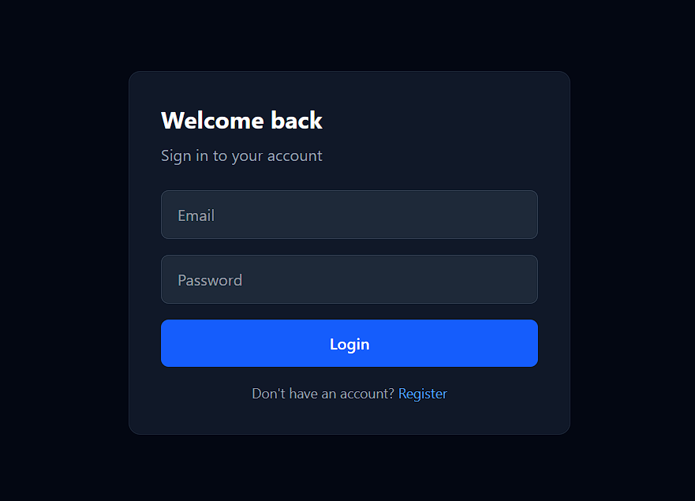
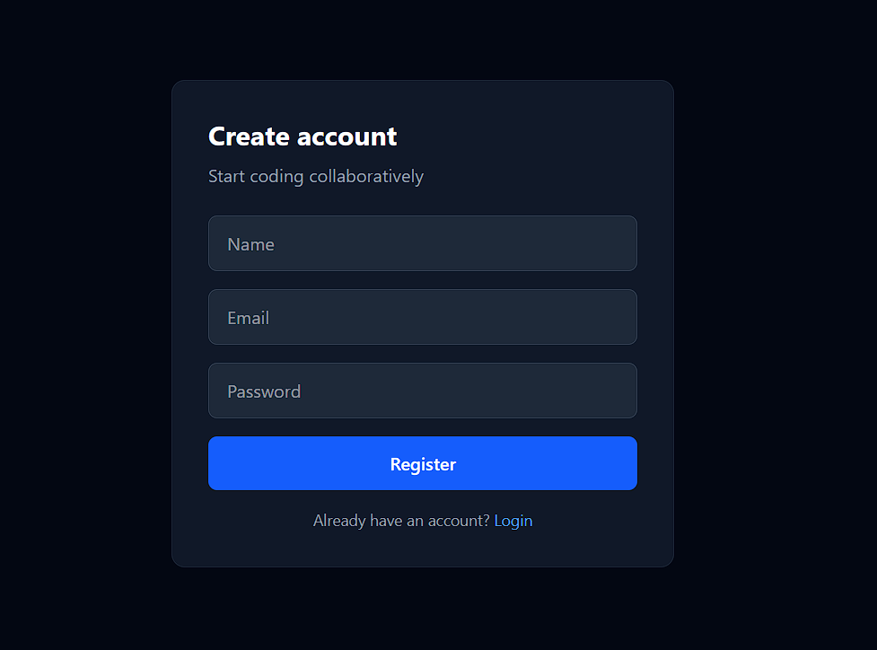
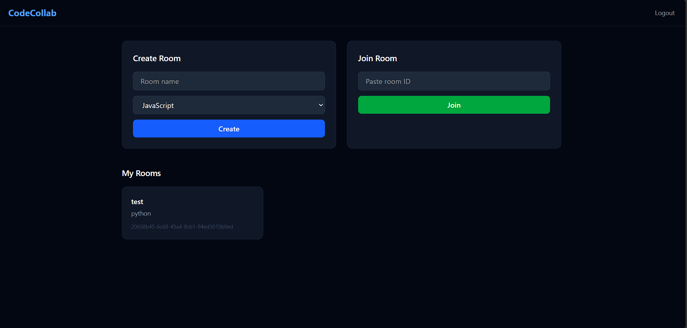
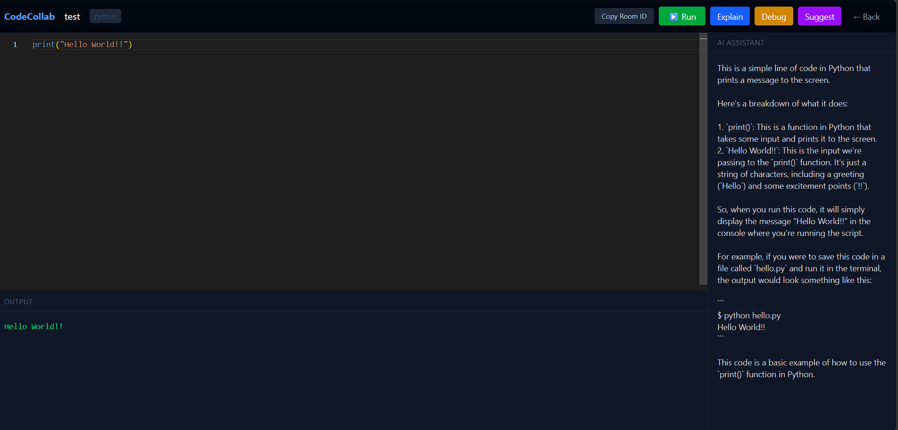

# CodeCollab — AI-Powered Collaborative Code Editor

A real-time collaborative code editor with AI assistance, built with the MERN stack.

🔗 **Live Demo**: [codecollab-iota.vercel.app](https://codecollab-iota.vercel.app)

> ⚠️ **Note**: The backend is hosted on Render's free tier and may take **30-60 seconds to wake up** on the first request. If login or register seems slow, wait a moment and try again.

---

## Screenshots

### Login


### Register


### Dashboard


### Editor


---

## Features

- **Real-time Collaboration** — Multiple users can code together in the same room simultaneously using WebSockets
- **Monaco Editor** — The same editor that powers VS Code, running in the browser
- **Code Execution** — Run Python and JavaScript code directly in the browser
- **AI Assistance** — Explain, debug, and get improvement suggestions for your code powered by Llama 3 via Groq
- **Room System** — Create a room, share the Room ID, and collaborate instantly
- **Authentication** — Secure JWT-based login and registration

---

## Architecture

```
┌─────────────────────────────────────────────────────────────┐
│                    CLIENT (React + Vite)                     │
│                                                             │
│   Login / Register → Dashboard → Editor                     │
│                                                             │
│   State: useState + useEffect                               │
│   Routing: React Router DOM                                 │
│   HTTP: Axios                   WebSocket: Socket.io Client │
└──────────────────────┬───────────────────────┬─────────────┘
                       │ REST API              │ WebSocket
                       ▼                       ▼
┌─────────────────────────────────────────────────────────────┐
│                SERVER (Node.js + Express)                    │
│                                                             │
│   /api/auth      → Register, Login (JWT)                    │
│   /api/sessions  → Create, Join, Get rooms                  │
│   /api/execute   → Run code (child_process)                 │
│   /api/ai        → Explain, Debug, Suggest (Groq)           │
│                                                             │
│   Middleware: JWT Auth                                      │
│   Real-time: Socket.io (join-room, code-change)             │
└──────────────────────┬───────────────────────┬─────────────┘
                       │ Mongoose ODM          │ Groq SDK
                       ▼                       ▼
┌──────────────────────────┐   ┌──────────────────────────────┐
│      MongoDB Atlas       │   │         Groq API             │
│                          │   │       (Llama 3.1 8B)         │
│   Collections:           │   │                              │
│   - users                │   │   - Code explanation         │
│   - sessions             │   │   - Debugging                │
│                          │   │   - Suggestions              │
└──────────────────────────┘   └──────────────────────────────┘
```

---

## Tech Stack

**Frontend**
- React (Vite)
- Tailwind CSS
- Monaco Editor
- Socket.io Client
- React Router DOM
- Axios

**Backend**
- Node.js
- Express.js
- Socket.io
- JWT Authentication
- Groq SDK (Llama 3.1)

**Database**
- MongoDB (Atlas)
- Mongoose

**Deployment**
- Frontend → Vercel
- Backend → Render
- Database → MongoDB Atlas

---

## Getting Started

### Prerequisites
- Node.js
- MongoDB (local or Atlas)
- Groq API key ([console.groq.com](https://console.groq.com))

### Installation

1. **Clone the repo**
```bash
git clone https://github.com/Thusyya-Vardhan/AI-Powered-Collaborative-Code-Editor.git
cd AI-Powered-Collaborative-Code-Editor
```

2. **Setup the backend**
```bash
cd Server
npm install
```

Create a `.env` file in the `Server` folder:
```env
MONGODB_URI=your_mongodb_connection_string
JWT_SECRET=your_jwt_secret
GROQ_API_KEY=your_groq_api_key
```

Start the server:
```bash
node index.js
```

3. **Setup the frontend**
```bash
cd Client
npm install
npm run dev
```

---

## Usage

1. Register an account
2. Create a room — choose a name and language
3. Share the Room ID with collaborators
4. Code together in real time
5. Hit **Run** to execute code
6. Use **Explain**, **Debug**, or **Suggest** for AI assistance

---

## Project Structure

```
AI-Powered-Collaborative-Code-Editor/
├── Client/                 # React frontend
│   ├── src/
│   │   ├── pages/          # Login, Register, Dashboard, Editor
│   │   ├── components/     # ProtectedRoute
│   │   └── config.js       # API URL config
│   └── vercel.json
├── Server/                 # Node.js backend
│   ├── models/             # User, Session schemas
│   ├── routes/             # auth, sessions, execute, ai
│   └── middleware/         # JWT auth middleware
├── screenshots/            # App screenshots
└── README.md
```

---

## Environment Variables

| Variable | Description |
|----------|-------------|
| `MONGODB_URI` | MongoDB connection string |
| `JWT_SECRET` | Secret key for JWT signing |
| `GROQ_API_KEY` | Groq API key for AI features |

---

## License

MIT